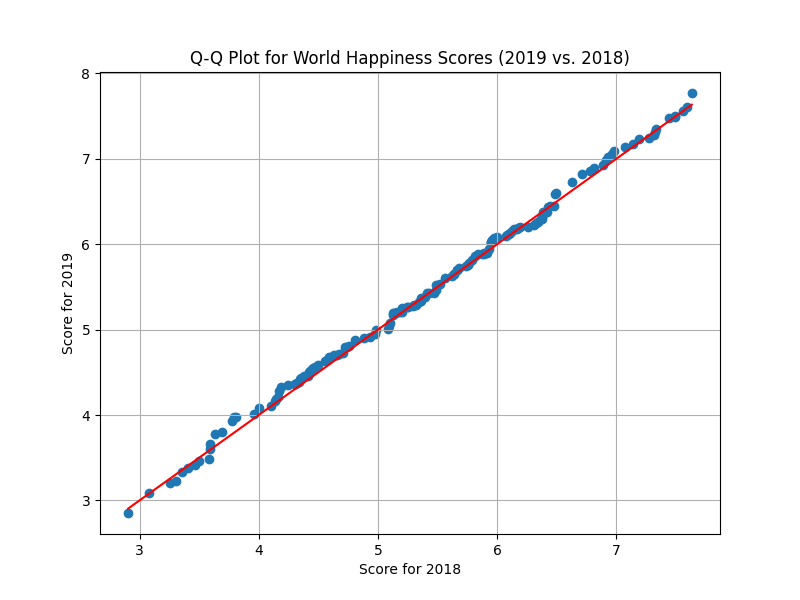

# Q-Q Plot for World Happiness Scores

This repository contains Python code to create a Quantile-Quantile (Q-Q) plot comparing World Happiness Scores for the years 2018 and 2019. The Q-Q plot is a graphical tool to assess the similarity of two datasets. In this case, it helps visualize whether the distribution of happiness scores in these two years is similar.

## Requirements

To run the code, you need to have the following installed:

- Python (3.6 or later)
- pandas
- matplotlib
- numpy

You can install the required libraries using `pip`:
```
pip install pandas matplotlib numpy
```

## Usage
1. Clone this repository to your local machine:
2. Navigate to the project directory
3. Place your CSV data files for 2018 and 2019 in the same directory with the following names:
   - `2018.csv` for 2018 data
   - `2019.csv` for 2019 data
4. Run the Python script to create the Q-Q plot and save it as a PNG file
5. The Q-Q plot will be saved as `qq_plot.png` in the same directory.
6. Optionally, you can view the plot on your screen by uncommenting the `plt.show()` line in `qq_plot.py`.

## Example Output



## License

This project is licensed under the MIT License. See the [LICENSE](LICENSE) file for details.